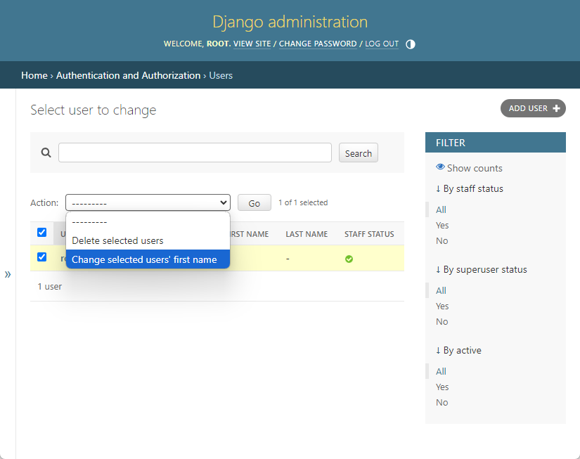

# django-form-action

Django action with an intermediate page to parse data from a form

## Installation

You can install the package via pip:

```
pip install django-form-action
```

Add `django_form_action` to `INSTALLED_APPS`.

## Demo




## Usage

Example usage showing an action in UserAdmin which has an intermediate form that parses data on how to perform that action.

```python
from typing import Any

from django.contrib import admin
from django.contrib import messages
from django.contrib.auth.admin import UserAdmin
from django.contrib.auth.models import User
from django.db.models import QuerySet
from django.forms import CharField
from django.forms import Form
from django.http import HttpRequest

from django_form_action import form_action

admin.site.unregister(User)


class ChangeFirstName(Form):
    first_name = CharField()


@form_action(
    User,
    ChangeFirstName,
    "Change selected users' first name",
)
def change_first_name(
    modeladmin: "admin.ModelAdmin[User]",
    request: HttpRequest,
    queryset: QuerySet[User],
    form: ChangeFirstName,
):
    queryset.update(first_name=form.cleaned_data["first_name"])
    messages.add_message(
        request,
        messages.INFO,
        "Successfully changed the first name of selected users.",
    )


@admin.register(User)
class CustomUserAdmin(UserAdmin):
    actions = [change_first_name]

```

## License

This project is licensed under the terms of the MIT license.
